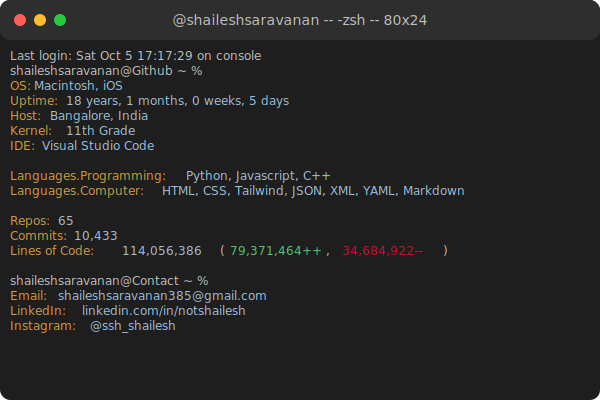

```bash
> Starting initialization...
```
---

## 🔍 `System Overview`


---

## 🛠 `Core Stack & Dependencies`

```yaml
languages:
  programming:
    - Python
    - JavaScript
    - C++
  markup_and_styles:
    - HTML
    - CSS
    - TailwindCSS
    - Markdown
  data_formats:
    - JSON
    - XML
    - YAML
frameworks:
  - Express
  - Node.js
  - Django
  - Flask
techServices:
  - Firebase
  - AWS
```

> **Note:** `print("Hello, World!")` was my first function, but now I build full-stack applications 🌐.

---

## ⚙ `Currently Running Processes `

Right now, my brain’s CPU is processing a lot of cool things:

```json
{
  "projects": {
    "Klide": "Beta Launch",
    "Python": "Machine Learning",
  },
  "status": "In-Progress",
  "dependencies": ["Coffee", "Apollo Server"]
}
```

---

## 📡 `Network Interfaces`

Feel free to `ping` me anytime via these ports:

- [LinkedIn](https://www.linkedin.com/in/notshailesh/)
- [Instagram](https://www.instagram.com/ssh_shailesh/)
- [Personal Website](https://shailesh.icu)
  
```bash
$ curl -X POST https://www.linkedin.com/in/notshailesh/ -d "Let's connect!"
```

---

## 📊 `GitHub.stats()`
[](https://quira.sh?utm_source=widgets&utm_campaign=Shaileshsaravanan)

---

## 💡 `Unexpected Output`

```bash
$ fortune | cowsay
```

- I can debug an infinite loop, but it takes me two tries to center a `div`.
- My favorite text editor is `vim`, and I believe in saving frequently because my code editor has **trust issues**.
- Fun fact: My code is **99% caffeine-powered**. ☕💻

---

## 📜 `License`

```bash
MIT License:
Permission is hereby granted to pursue creative coding, endless bug fixing, and caffeinated development, free of charge, to anyone who understands the joy of coding. As long as the resulting software does not crash on deployment.  
```

---

```bash
> Terminating process...
$ logout
```
